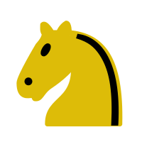

# Schach - Online Schachplattform

Eine moderne, interaktive Schachplattform, entwickelt mit Laravel und Vue.js.



## Über das Projekt

Dieses Projekt ist eine vollständige Schachplattform, die es Benutzern ermöglicht, Schach online zu spielen - entweder gegen andere Spieler in Echtzeit oder gegen verschiedene KI-Gegner. Die Anwendung nutzt moderne Webtechnologien für ein reaktionsschnelles und ansprechendes Spielerlebnis.

### Hauptfunktionen

- Interaktives Schachbrett mit Drag-and-Drop-Funktionalität
- Vollständige Implementierung der Schachregeln
- Multiplayer-Modus in Echtzeit
- KI-Gegner mit verschiedenen Schwierigkeitsgraden
- Spielanalyse und Zugvorschläge
- Benutzerprofile und Ranglisten
- Spielhistorie und PGN-Export

## Technologien

### Backend
- Laravel 10.x
- Inertia.js Server-Adapter
- Laravel Sanctum (Authentication)
- Laravel WebSockets/Pusher (Echtzeit-Kommunikation)
- Queue System (für Engine-Berechnungen)

### Frontend
- Vue 3 (Composition API)
- Inertia.js Client-Adapter
- Pinia (State Management)
- Tailwind CSS
- Vue-Draggable (für Schachfiguren)

## Installation

### Voraussetzungen
- Docker und Docker Compose
- PHP 8.4 oder höher
- Composer
- Node.js und NPM

### Schritte zur Installation

1. Repository klonen:
   ```bash
   git clone https://github.com/yourusername/schach.git
   cd schach
   ```

2. Abhängigkeiten installieren:
   ```bash
   composer install
   npm install
   ```

3. Umgebungsvariablen konfigurieren:
   ```bash
   cp .env.example .env
   php artisan key:generate
   ```

4. Docker-Container starten:
   ```bash
   ./vendor/bin/sail up -d
   ```

5. Datenbank-Migrationen ausführen:
   ```bash
   ./vendor/bin/sail artisan migrate
   ```

6. Frontend-Assets kompilieren:
   ```bash
   ./vendor/bin/sail npm run dev
   ```

7. Die Anwendung ist nun unter http://localhost erreichbar

## Entwicklung

### Entwicklungsumgebung

Das Projekt verwendet Laravel Sail für eine Docker-basierte Entwicklungsumgebung. Folgende Dienste sind verfügbar:

- **Laravel**: PHP-Anwendungsserver
- **MySQL**: Datenbank
- **Redis**: Cache und Queues
- **Mailpit**: E-Mail-Testing
- **Soketi**: WebSocket-Server
- **Meilisearch**: Suchfunktionalität

### Nützliche Befehle

- Server starten: `./vendor/bin/sail up -d`
- Server stoppen: `./vendor/bin/sail down`
- Composer-Befehle: `./vendor/bin/sail composer <command>`
- Artisan-Befehle: `./vendor/bin/sail artisan <command>`
- NPM-Befehle: `./vendor/bin/sail npm <command>`
- Tests ausführen: `./vendor/bin/sail test`

## Projektstruktur

```
Schach/
├── app/
│   ├── Http/Controllers/
│   │   ├── GameController.php
│   │   ├── AuthController.php
│   │   ├── ChessEngineController.php
│   ├── Models/
│   │   ├── User.php
│   │   ├── Game.php
│   │   ├── Move.php
│   │   ├── ChessEngine.php
│   ├── Services/
│   │   ├── ChessEngineService.php
│   │   ├── GameLogicService.php
│   │   ├── MultiplayerService.php
│   ├── Events/
│   │   ├── GameStarted.php
│   │   ├── MoveMade.php
│   │   ├── GameEnded.php
├── resources/
│   ├── js/
│   │   ├── Components/
│   │   │   ├── ChessBoard.vue
│   │   │   ├── ChessPiece.vue
│   │   │   ├── GameControls.vue
│   │   ├── Pages/
│   │   │   ├── Game/
│   │   │   ├── Dashboard.vue
│   │   ├── Stores/
│   │   │   ├── gameStore.js
│   │   │   ├── boardStore.js
│   │   │   ├── pieceStore.js
├── routes/
│   ├── web.php
│   ├── channels.php
├── database/
│   ├── migrations/
├── docs/
│   ├── tasks.md
```

## Roadmap

Die Entwicklung des Projekts ist in mehrere Phasen unterteilt:

### Phase 1: Grundgerüst ✓
- Laravel + Inertia.js Setup
- Basis-Schachbrett (Vue-Komponente)
- Einfache Spiellogik

### Phase 2: Core Features (In Bearbeitung)
- PvP-Spiele (lokal)
- Grundlegende Schachregeln
- Spielhistorie
- Profil-Management

### Phase 3: Multiplayer (Geplant)
- WebSocket-Integration
- Live-Spiele zwischen Benutzern
- Lobby-System
- Spectator-Modus

### Phase 4: Engine-Integration (Geplant)
- Stockfish-Integration
- Engine-Management-System
- Verschiedene Schwierigkeitsgrade
- Analyse-Features

Für eine detaillierte Liste der geplanten Aufgaben, siehe [docs/tasks.md](docs/tasks.md).

## Mitwirken

Beiträge zum Projekt sind willkommen! Bitte folgen Sie diesen Schritten:

1. Fork des Repositories
2. Feature-Branch erstellen (`git checkout -b feature/AmazingFeature`)
3. Änderungen committen (`git commit -m 'Add some AmazingFeature'`)
4. Branch pushen (`git push origin feature/AmazingFeature`)
5. Pull Request erstellen

## Lizenz

Dieses Projekt ist unter der MIT-Lizenz lizenziert - siehe die [LICENSE](LICENSE) Datei für Details.
